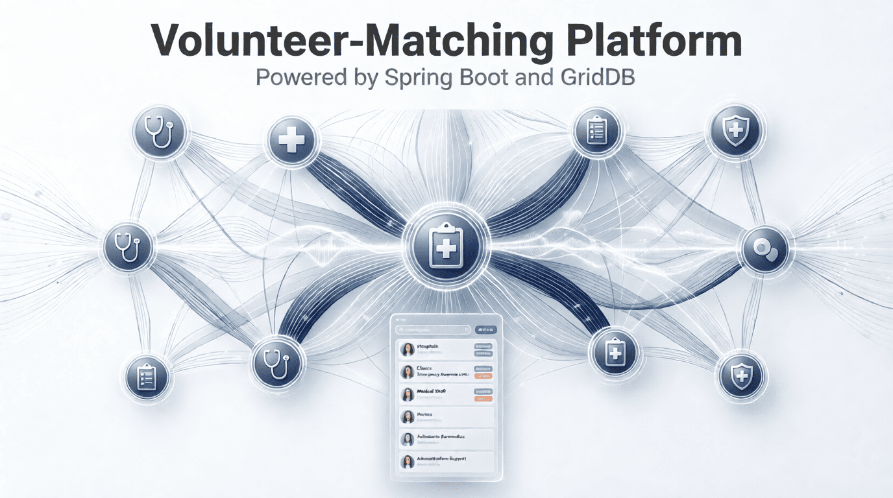
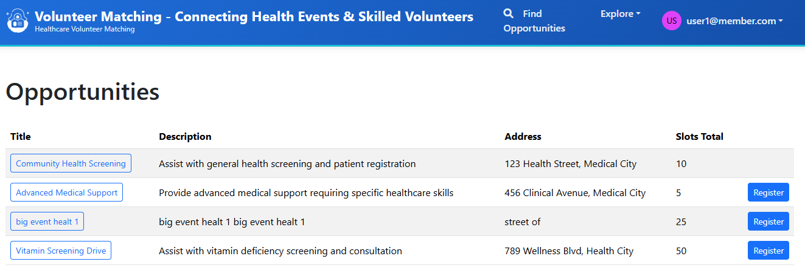
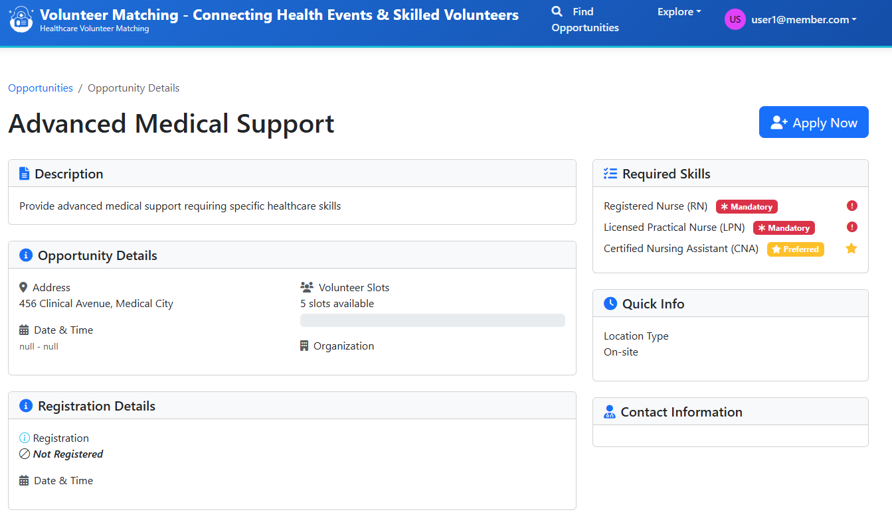

# Building a Volunteer-Matching System for Health Events: A Full-Stack Java Tutorial



Welcome! We're about to build something useful, a **volunteer-matching platform** that connects skilled medical professionals with health organizations that need them. It's the kind of system you'd see powering real health events, from blood drives to vaccination clinics. By the time we're done, you'll understand how to architect and deploy a complete full-stack application that handles real-world complexity, including matching qualified people to opportunities, managing permissions across different user roles, and keeping everything secure.

## The Stack: Technologies That Work Together

We're using a carefully selected tech stack that mirrors what you'll find in production environments:

- **Spring Boot & Thymeleaf** handles the business rules, data orchestration, and renders dynamic HTML templates on the server side.
- **GridDB** (cloud-hosted NoSQL datastore) stores volunteer profiles, opportunities, and applications.

Each technology serves a specific purpose, and together they create a seamless user experience backed by robust backend logic.

## Learning Roadmap

We'll move from foundation to mastery:

- **Setup & Architecture**: We'll start by understanding the three-layer system design, laying out your Maven project structure, and configuring Spring Boot for success.

- **Core Features**: Next, we'll implement the data model (entities, relationships, indexing) and set up GridDB integration.

- **User Interface & Experience**: Then we'll create server-rendered Thymeleaf templates for browsing opportunities, applying for roles, and managing skills. You'll see how server-side rendering keeps everything simple.

- **Security**: We'll add Spring Security authentication, implement role-based access control, ensuring organizers see different screens than volunteers, and ensuring data stays protected.

- **Real-World Patterns**: Finally, integrate real-time slot updates.

By completing this tutorial, you'll understand how to architect a full-stack Java application from database to user interface. More importantly, you'll have a complete, deployable system you can adapt to other matching problems.

Let's build something real.

## Project Setup

Here's how we'll set it up:

1. Navigate to [start.spring.io](https://start.spring.io/)
2. Configure your project:
   - **Project**: Maven
   - **Language**: Java
   - **Spring Boot**: 3.5.x (latest stable version)
   - **Group**: com.example
   - **Artifact**: springboot-volunteermatching
   - **Java Version**: 21

3. Add the following dependencies:
   - **Spring Web**
   - **Thymeleaf**
   - **Spring Security**

4. Click **Generate** to download a ZIP file with our project structure

Once you've downloaded and extracted the project, import it into your IDE.

Next, we will create the package structure by grouping the classes based on their respective entities, e.g., a package `organization` contains the controller, service, DTO, etc.

```sh
volunteer-matching/
├── pom.xml
├── src/main/java/com/volunteermatching/
│   ├── config/           (RestClient config)
│   ├── griddb/
│   ├── griddbwebapi/
│   ├── opportunity/
│   ├── opportunity_requirement/
│   ├── organization/
│   ├── organization_member/
│   ├── registration/
│   └── security/         (Auth filters, RBAC)
│   ├── skill/
│   ├── user/
│   ├── volunteer_skill/
└── src/main/resources/
    ├── templates/        (Thymeleaf templates)
    └── application.properties   (Configuration)
```

## Connecting to the GridDB Cloud

Configure the credentials for connecting to the GridDB Cloud through HTTP. Add the following to `application.properties`:

```txt
# GridDB Configuration
griddbcloud.base-url=https://cloud5197.griddb.com:443/griddb/v2/gs_cluster
griddbcloud.auth-token=TTAxxxxxxx
```

Next, create a `bean` of `org.springframework.web.client.RestClient` that provides a fluent, builder-based API for sending synchronous and asynchronous HTTP requests with cleaner syntax and improved readability.

```java
@Configuration
public class RestClientConfig {
    final Logger LOGGER = LoggerFactory.getLogger(RestClientConfig.class);

    @Bean("GridDbRestClient")
    public RestClient gridDbRestClient(
            @NonNull @Value("${griddbcloud.base-url}") final String baseUrl,
            @NonNull @Value("${griddbcloud.auth-token}") final String authToken) {
        return RestClient.builder()
                .baseUrl(baseUrl)
                .defaultHeader(HttpHeaders.AUTHORIZATION, "Basic " + authToken)
                .defaultHeader(HttpHeaders.CONTENT_TYPE, MediaType.APPLICATION_JSON_VALUE)
                .defaultHeader(HttpHeaders.ACCEPT, MediaType.APPLICATION_JSON_VALUE)
                .defaultStatusHandler(
                        status -> status.is4xxClientError() || status.is5xxServerError(), (request, response) -> {
                            String responseBody = getResponseBody(response);
                            LOGGER.error("GridDB API error: status={} body={}", response.getStatusCode(), responseBody);
                            if (response.getStatusCode().value() == 403) {
                                LOGGER.error("Access forbidden - please check your auth token and permissions.");
                                throw new ForbiddenGridDbConnectionException("Access forbidden to GridDB Cloud API.");
                            }
                            throw new GridDbException("GridDB API error: ", response.getStatusCode(), responseBody);
                        })
                .requestInterceptor((request, body, execution) -> {
                    final long begin = System.currentTimeMillis();
                    ClientHttpResponse response = execution.execute(request, body);
                    logDuration(request, body, begin, response);
                    return response;
                })
                .build();
    }
}
```

- `@Bean("GridDbRestClient")`: register this client as a Spring bean so we can inject it anywhere with `@Qualifier("GridDbRestClient") final RestClient restClient`.
- `.baseUrl(baseUrl)`: set the common base URL for all requests.
- `.defaultHeader(...)`: adds a header that will be sent with every request.
- `.defaultStatusHandler(...)`: when the API return an error (4xx or 5xx status code), log the error status. If the status is 403, throws a custom `ForbiddenGridDbConnectionException`. For any other error, it throws a general `GridDbException`.
- `.requestInterceptor(`: log how long the request took for debugging performance.

Next, create a helper that will be used by each service class to talk to the GridDB Cloud over the internet using HTTP requests. It wraps a pre-configured `RestClient` and provides easy-to-use methods for common database operations. All the complicated stuff (URLs, headers, error handling) is hidden inside this class.

```java
@Component
public class GridDbClient {
    private final RestClient restClient;
    public GridDbClient(@Qualifier("GridDbRestClient") final RestClient restClient) {
        this.restClient = restClient;
    }

    public void createContainer(final GridDbContainerDefinition containerDefinition) {
        try {
            restClient
                    .post()
                    .uri("/containers")
                    .body(containerDefinition)
                    .retrieve()
                    .toBodilessEntity();
        } catch (Exception e) {
            throw new GridDbException("Failed to create container", HttpStatusCode.valueOf(500), e.getMessage(), e);
        }
    }

    public void registerRows(String containerName, Object body) {
        try {
            ResponseEntity<String> result = restClient
                    .put()
                    .uri("/containers/" + containerName + "/rows")
                    .body(body)
                    .retrieve()
                    .toEntity(String.class);
        } catch (Exception e) {
            throw new GridDbException("Failed to execute PUT request", HttpStatusCode.valueOf(500), e.getMessage(), e);
        }
    }

    public AcquireRowsResponse acquireRows(String containerName, AcquireRowsRequest requestBody) {
        try {
            ResponseEntity<AcquireRowsResponse> responseEntity = restClient
                    .post()
                    .uri("/containers/" + containerName + "/rows")
                    .body(requestBody)
                    .retrieve()
                    .toEntity(AcquireRowsResponse.class);
            return responseEntity.getBody();
        } catch (Exception e) {
            throw new GridDbException("Failed to execute GET request", HttpStatusCode.valueOf(500), e.getMessage(), e);
        }
    }

    public SQLSelectResponse[] select(List<GridDbCloudSQLStmt> sqlStmts) {
        try {
            ResponseEntity<SQLSelectResponse[]> responseEntity = restClient
                    .post()
                    .uri("/sql/dml/query")
                    .body(sqlStmts)
                    .retrieve()
                    .toEntity(SQLSelectResponse[].class);
            return responseEntity.getBody();
        } catch (Exception e) {
            throw new GridDbException("Failed to execute /sql/dml/query", HttpStatusCode.valueOf(500), e.getMessage(), e);
        }
    }

    public SqlExecutionResult[] executeSqlDDL(List<GridDbCloudSQLStmt> sqlStmts) {
        try {
            ResponseEntity<SqlExecutionResult[]> responseEntity =
                    restClient.post().uri("/sql/ddl").body(sqlStmts).retrieve().toEntity(SqlExecutionResult[].class);
            return responseEntity.getBody();
        } catch (Exception e) {
            throw new GridDbException("Failed to execute SQL DDL", HttpStatusCode.valueOf(500), e.getMessage(), e);
        }
    }

    public SQLUpdateResponse[] executeSQLUpdate(List<GridDbCloudSQLStmt> sqlStmts) {
        try {
            ResponseEntity<SQLUpdateResponse[]> responseEntity = restClient
                    .post()
                    .uri("/sql/dml/update")
                    .body(sqlStmts)
                    .retrieve()
                    .toEntity(SQLUpdateResponse[].class);
            return responseEntity.getBody();
        } catch (Exception e) {
            throw new GridDbException("Failed to execute /sql/dml/update", HttpStatusCode.valueOf(500), e.getMessage(), e);
        }
    }
}
```

The constructor takes a `RestClient` that was named `GridDbRestClient`. The `@Qualifier` makes sure we get the correct one. Every method follows the same safe structure:

- Try to send an HTTP request using `restClient`.
- If something goes wrong (network issue, wrong data, server error), catch the exception.

## Data Model using DTOs

Now, let's create the Data Transfer Objects (DTOs). DTOs are simple classes that carry information from one part of the app to another, for example, from the database to the screen.

In this project, the DTOs represent important things like users, skills, organizations, and volunteer events. Each DTO has its own fields to hold the data. Each DTO matches the structure of rows inside one GridDB container.

- `UserDTO`: represents a user in the system, such as a volunteer or an organization admin. It's used to create, update, or display user information.

    ```java
    public class UserDTO {
        @Size(max = 255)
        @UserIdValid
        private String id;

        @NotNull
        @Size(max = 255)
        @UserEmailUnique
        private String email;

        @NotNull
        @Size(max = 255)
        private String fullName;

        @NotNull
        private UserRole role;
        // Setter and Getter
    }
    ```

- `SkillDTO`: represents a skill that volunteers can have, such as "First Aid" or "Paramedic." It's used to manage the list of available skills.

    ```java
    public class SkillDTO {

        @Size(max = 255)
        private String id;

        @NotNull
        @Size(max = 255)
        @SkillNameUnique
        private String name;

        public SkillDTO() {}

        public SkillDTO(String id, String name) {
            this.id = id;
            this.name = name;
        }
        // Setter and Getter
    }
    ```

- `VolunteerSkillDTO`: links a user (volunteer) to a specific skill. It includes details like when the skill expires and its verification status. It's useful for tracking what skills a volunteer has and their validity.

- `OrganizationDTO`: represents an organization that creates volunteer opportunities. It's used to manage organization details.

- `OrganizationMemberDTO`: links a user to an organization, specifying their role within it (e.g., member or admin). It's used to manage who belongs to which organization.

- `OpportunityDTO`: represents a volunteer opportunity, like an event that needs volunteers. It's used to create and display opportunities.

- `OpportunityRequirementDTO`: specifies the skills required for a volunteer opportunity. It links an opportunity to skills and indicates if a skill is mandatory.

- `RegistrationDTO`: represents a volunteer's registration for an opportunity. It tracks who signed up and the status of their registration.

## Service Layer and Business Logic

Next, we implement the service layer. The services will utilize these DTOs to handle business logic, communicate with GridDB Cloud through our client, and prepare data for the controllers.

The Service class does not use any repository layer like JPA. Instead, it directly connects to GridDB, which is a database, using a `GridDbClient`. The Service class implements the interface, which means it must provide methods like `findAll()` to get all rows and `get()` to find one by ID, `create` to add a new row, and others. When fetching data, it sends requests to GridDB to get rows, then maps those rows into DTO objects. For saving or updating, it builds a string in JSON format with data and sends it to GridDB Cloud. It also generates unique IDs using `TsidCreator` and handles date times carefully by parsing and formatting them.

```java
@Service
public class RegistrationGridDBService implements RegistrationService {
    private final Logger log = LoggerFactory.getLogger(getClass());
    private final GridDbClient gridDbClient;
    private final String TBL_NAME = "VoMaRegistrations";
    public RegistrationGridDBService(final GridDbClient gridDbClient) {
        this.gridDbClient = gridDbClient;
    }

    public void createTable() {
        List<GridDbColumn> columns = List.of(
                new GridDbColumn("id", "STRING", Set.of("TREE")),
                new GridDbColumn("userId", "STRING", Set.of("TREE")),
                new GridDbColumn("opportunityId", "STRING", Set.of("TREE")),
                new GridDbColumn("status", "STRING"),
                new GridDbColumn("registrationTime", "TIMESTAMP"));

        GridDbContainerDefinition containerDefinition = GridDbContainerDefinition.build(TBL_NAME, columns);
        this.gridDbClient.createContainer(containerDefinition);
    }

    @Override
    public List<RegistrationDTO> findAll() {
        AcquireRowsRequest requestBody =
                AcquireRowsRequest.builder().limit(50L).sort("id ASC").build();
        AcquireRowsResponse response = this.gridDbClient.acquireRows(TBL_NAME, requestBody);
        if (response == null || response.getRows() == null) {
            log.error("Failed to acquire rows from GridDB");
            return List.of();
        }
        return response.getRows().stream()
                .map(row -> {
                    return extractRowToDTO(row);
                })
                .collect(Collectors.toList());
    }

    private RegistrationDTO extractRowToDTO(List<Object> row) {
        RegistrationDTO dto = new RegistrationDTO();
        dto.setId((String) row.get(0));
        dto.setUserId((String) row.get(1));
        dto.setOpportunityId((String) row.get(2));
        try {
            dto.setStatus(RegistrationStatus.valueOf(row.get(3).toString()));
        } catch (Exception e) {
            dto.setStatus(null);
        }
        try {
            dto.setRegistrationTime(DateTimeUtil.parseToLocalDateTime(row.get(4).toString()));
        } catch (Exception e) {
            dto.setRegistrationTime(null);
        }
        return dto;
    }

    @Override
    public RegistrationDTO get(final String id) {
        AcquireRowsRequest requestBody = AcquireRowsRequest.builder()
                .limit(1L)
                .condition("id == '" + id + "'")
                .build();
        AcquireRowsResponse response = this.gridDbClient.acquireRows(TBL_NAME, requestBody);
        if (response == null || response.getRows() == null) {
            log.error("Failed to acquire rows from GridDB");
            throw new NotFoundException("Registration not found with id: " + id);
        }
        return response.getRows().stream()
                .findFirst()
                .map(row -> {
                    return extractRowToDTO(row);
                })
                .orElseThrow(() -> new NotFoundException("Registration not found with id: " + id));
    }

    public String nextId() {
        return TsidCreator.getTsid().format("reg_%s");
    }

    @Override
    public String register(String userId, String opportunityId) {
        RegistrationDTO registrationDTO = new RegistrationDTO();
        registrationDTO.setUserId(userId);
        registrationDTO.setOpportunityId(opportunityId);
        registrationDTO.setStatus(RegistrationStatus.PENDING);
        registrationDTO.setRegistrationTime(LocalDateTime.now());
        return create(registrationDTO);
    }
}
```

### Implement the validation

We create a dedicated Service class for validating volunteer registration requests against opportunity requirements. Some benefit from this approach:

- Hides the complexity. If the rules change later (e.g., "User needs 2 out of 3 skills"), we only change that one place
- Business validation logic isolated from HTTP concern
- Validation service can be used by REST APIs or other controllers
- Service can be unit tested independently
- Clear, focused exception handling with rich context

```java
@Service
public class RegistrationValidationService {
    private final Logger log = LoggerFactory.getLogger(getClass());
    private final RegistrationService registrationService;
    private final OpportunityService opportunityService;
    private final OpportunityRequirementService opportunityRequirementService;
    private final VolunteerSkillService volunteerSkillService;
    private final SkillService skillService;

    public RegistrationValidationService(
            final RegistrationService registrationService,
            final OpportunityService opportunityService,
            final OpportunityRequirementService opportunityRequirementService,
            final VolunteerSkillService volunteerSkillService,
            final SkillService skillService) {
        this.registrationService = registrationService;
        this.opportunityService = opportunityService;
        this.opportunityRequirementService = opportunityRequirementService;
        this.volunteerSkillService = volunteerSkillService;
        this.skillService = skillService;
    }

    public void validateRegistration(final String userId, final String opportunityId) {
        // Check 1: User not already registered
        validateNotAlreadyRegistered(userId, opportunityId);

        // Check 2: Opportunity has available slots
        validateSlotsAvailable(opportunityId);

        // Check 3: User has mandatory skills
        validateMandatorySkills(userId, opportunityId);
    }

    private void validateNotAlreadyRegistered(final String userId, final String opportunityId) {
        Optional<RegistrationDTO> existingReg = registrationService.getByUserIdAndOpportunityId(userId, opportunityId);
        if (existingReg.isPresent()) {
            throw new AlreadyRegisteredException(userId, opportunityId);
        }
    }

    private void validateSlotsAvailable(final String opportunityId) {
        OpportunityDTO opportunity = opportunityService.get(opportunityId);
        Long registeredCount = registrationService.countByOpportunityId(opportunityId);

        if (registeredCount >= opportunity.getSlotsTotal()) {
            throw new OpportunitySlotsFullException(opportunityId, opportunity.getSlotsTotal(), registeredCount);
        }
    }

    private void validateMandatorySkills(final String userId, final String opportunityId) {
        List<VolunteerSkillDTO> userSkills = volunteerSkillService.findAllByUserId(userId);
        List<OpportunityRequirementDTO> opportunityRequirements =
                opportunityRequirementService.findAllByOpportunityId(opportunityId);

        for (OpportunityRequirementDTO requirement : opportunityRequirements) {
            if (!requirement.getIsMandatory()) {
                continue;
            }

            boolean hasSkill = userSkills.stream()
                    .anyMatch(userSkill -> userSkill.getSkillId().equals(requirement.getSkillId()));

            if (!hasSkill) {
                SkillDTO skill = skillService.get(requirement.getSkillId());
                String skillName = skill != null ? skill.getName() : "Unknown Skill";
                throw new MissingMandatorySkillException(userId, opportunityId, requirement.getSkillId(), skillName);
            }
        }
    }
}
```

This service depends on 5 collaborating services (Opportunity, OpportunityRequirement, VolunteerSkill, Skill, Registration) and throws custom exceptions for each validation failure, allowing callers to handle different error scenarios appropriately (e.g., different error messages, logging, etc).

## HTTP Layer

Now, we need a class that handles all incoming web requests, processes user input, and sends back responses. It's the bridge between the user's browser and the application's code logic.

```java
@Controller
@RequestMapping("/opportunities")
public class OpportunityController {
    private final Logger log = LoggerFactory.getLogger(getClass());
    private final OpportunityService opportunityService;
    private final RegistrationService registrationService;
    private final RegistrationValidationService registrationValidationService;
    private final UserService userService;
    private final OpportunityRequirementService opportunityRequirementService;
    private final SkillService skillService;

    public OpportunityController(
            final OpportunityService opportunityService,
            final RegistrationService registrationService,
            final RegistrationValidationService registrationValidationService,
            final UserService userService,
            final OpportunityRequirementService opportunityRequirementService,
            final SkillService skillService) {
        this.opportunityService = opportunityService;
        this.registrationService = registrationService;
        this.registrationValidationService = registrationValidationService;
        this.userService = userService;
        this.opportunityRequirementService = opportunityRequirementService;
        this.skillService = skillService;
    }

    @GetMapping
    public String list(final Model model, @AuthenticationPrincipal final CustomUserDetails userDetails) {
        List<OpportunityDTO> allOpportunities = new ArrayList<>();
        UserDTO user = userDetails != null
                ? userService.getOneByEmail(userDetails.getUsername()).orElse(null)
                : null;
        if (userDetails != null
                && userDetails.getOrganizations() != null
                && !userDetails.getOrganizations().isEmpty()) {
            OrganizationDTO org = userDetails.getOrganizations().get(0);
            model.addAttribute("organization", org);
            allOpportunities = opportunityService.findAllByOrgId(org.getId());
        } else {
            model.addAttribute("organization", null);
            allOpportunities = opportunityService.findAll();
        }
        List<OpportunityResponse> opportunities = extractOpportunities(allOpportunities, user);
        model.addAttribute("opportunities", opportunities);
        return "opportunity/list";
    }

    @GetMapping("/add")
    @PreAuthorize(SecurityExpressions.ORGANIZER_ONLY)
    public String add(
            @ModelAttribute("opportunity") final OpportunityDTO opportunityDTO,
            final Model model,
            @AuthenticationPrincipal final CustomUserDetails userDetails) {
        if (userDetails != null
                && userDetails.getOrganizations() != null
                && !userDetails.getOrganizations().isEmpty()) {
            OrganizationDTO org = userDetails.getOrganizations().get(0);
            opportunityDTO.setOrgId(org.getId());
        }
        opportunityDTO.setId(opportunityService.nextId());
        return "opportunity/add";
    }

    @PostMapping("/add")
    @PreAuthorize(SecurityExpressions.ORGANIZER_ONLY)
    public String add(
            @ModelAttribute("opportunity") @Valid final OpportunityDTO opportunityDTO,
            final BindingResult bindingResult,
            final RedirectAttributes redirectAttributes) {
        if (bindingResult.hasErrors()) {
            return "opportunity/add";
        }
        opportunityService.create(opportunityDTO);
        redirectAttributes.addFlashAttribute(WebUtils.MSG_SUCCESS, WebUtils.getMessage("opportunity.create.success"));
        return "redirect:/opportunities";
    }

    @GetMapping("/edit/{id}")
    @PreAuthorize(SecurityExpressions.ORGANIZER_ONLY)
    public String edit(@PathVariable(name = "id") final String id, final Model model) {
        model.addAttribute("opportunity", opportunityService.get(id));
        return "opportunity/edit";
    }

    @PostMapping("/edit/{id}")
    @PreAuthorize(SecurityExpressions.ORGANIZER_ONLY)
    public String edit(
            @PathVariable(name = "id") final String id,
            @ModelAttribute("opportunity") @Valid final OpportunityDTO opportunityDTO,
            final BindingResult bindingResult,
            final RedirectAttributes redirectAttributes) {
        if (bindingResult.hasErrors()) {
            return "opportunity/edit";
        }
        opportunityService.update(id, opportunityDTO);
        redirectAttributes.addFlashAttribute(WebUtils.MSG_SUCCESS, WebUtils.getMessage("opportunity.update.success"));
        return "redirect:/opportunities";
    }

    @PostMapping("/{id}/registrations")
    public String registrations(
            @PathVariable(name = "id") final String opportunityId,
            final RedirectAttributes redirectAttributes,
            @AuthenticationPrincipal final UserDetails userDetails) {
        UserDTO user = userService
                .getOneByEmail(userDetails.getUsername())
                .orElseThrow(() -> new UsernameNotFoundException("User not found"));
        try {
            // Validate registration using the validation service
            registrationValidationService.validateRegistration(user.getId(), opportunityId);

            // If validation passes, proceed with registration
            OpportunityDTO opportunityDTO = opportunityService.get(opportunityId);
            registrationService.register(user.getId(), opportunityId);
            log.debug(
                    "Registration Successful - user: {}, opportunity: {}",
                    user.getFullName(),
                    opportunityDTO.getTitle());
            redirectAttributes.addFlashAttribute(
                    WebUtils.MSG_INFO, WebUtils.getMessage("opportunity.registrations.success"));
            return "redirect:/opportunities/" + opportunityId;

        } catch (AlreadyRegisteredException e) {
            redirectAttributes.addFlashAttribute(
                    WebUtils.MSG_ERROR, WebUtils.getMessage("opportunity.registrations.already_registered"));
            return "redirect:/opportunities/" + opportunityId;

        } catch (OpportunitySlotsFullException e) {
            redirectAttributes.addFlashAttribute(
                    WebUtils.MSG_ERROR, WebUtils.getMessage("opportunity.registrations.full"));
            return "redirect:/opportunities/" + opportunityId;

        } catch (MissingMandatorySkillException e) {
            redirectAttributes.addFlashAttribute(
                    WebUtils.MSG_ERROR,
                    WebUtils.getMessage("opportunity.registrations.missing_skill", e.getSkillName()));
            return "redirect:/opportunities/" + opportunityId;
        }
    }
}
```

The `OpportunityController.java`:

- Doesn't do the work itself; it delegates to specialized services. This keeps code organized and reusable.
- Manages everything related to `/opportunities` URLs, for example, listing volunteer opportunities.
- Receives **services** it needs using **constructor injection**.
- `@PreAuthorize` ensures only authorized users perform actions
- Validate registration using `registrationValidationService`. If validation fails, catches specific exceptions and shows error messages.
- Clean Controller: focus on orchestration only

> Note: The entire code for the web application is available on [Github](https://github.com/alifruliarso?tab=repositories).

## User Interface Preview

- Listing opportunity page:


<br>

- Register page:


<br>

## Conclusion

Building a volunteer-matching web for a health event is a practical project that trains core skills: Spring Boot service design, server-rendered Thymeleaf UI, Cloud NoSQL integration, and RBAC. Feel free to add more feature like email notifications or calendar integration. Keep building, keep learning.
